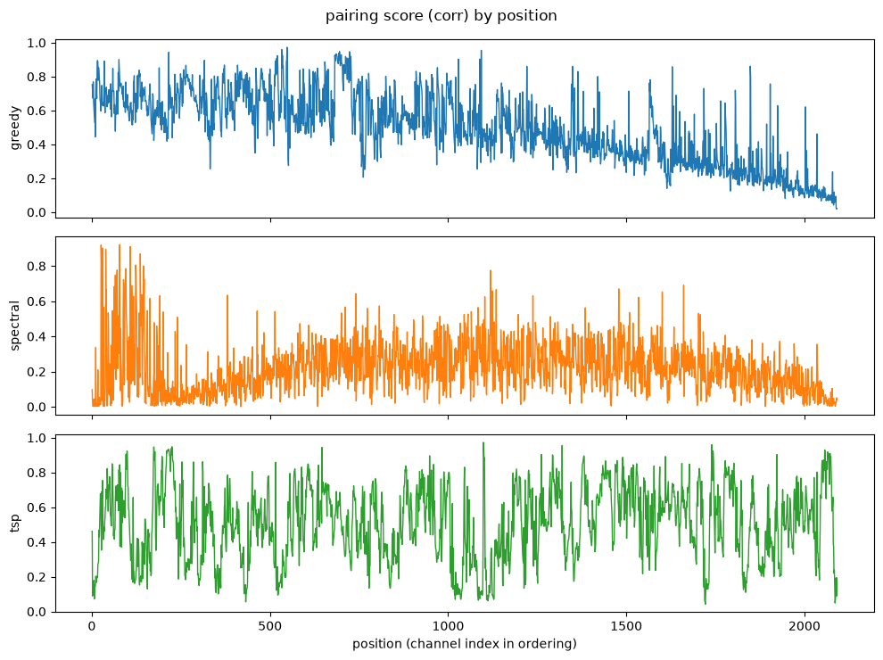
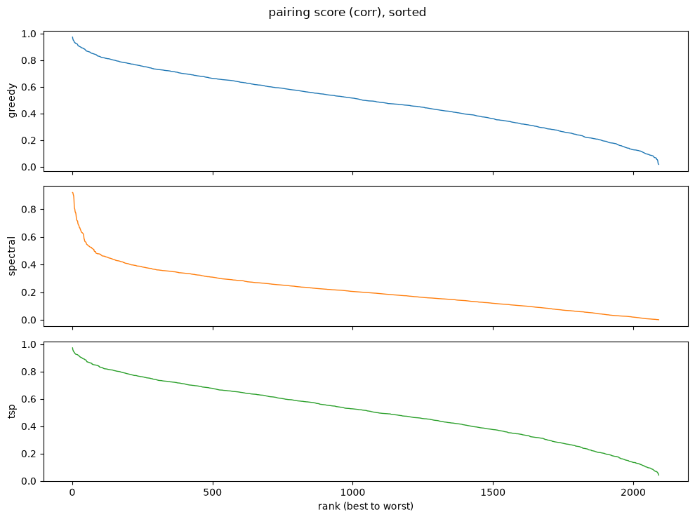
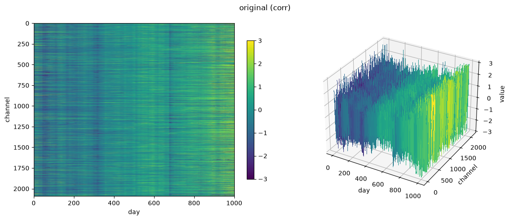
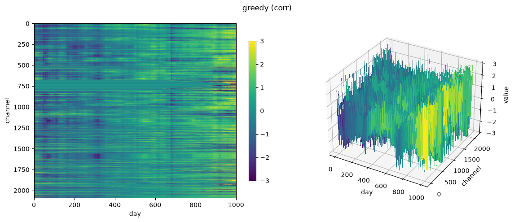
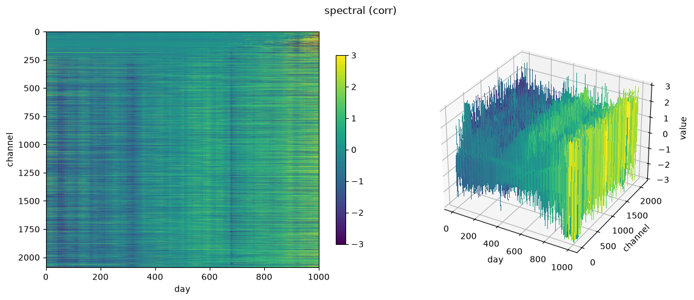
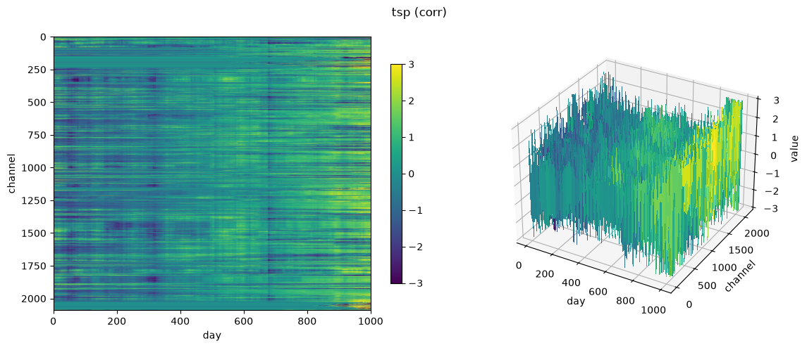
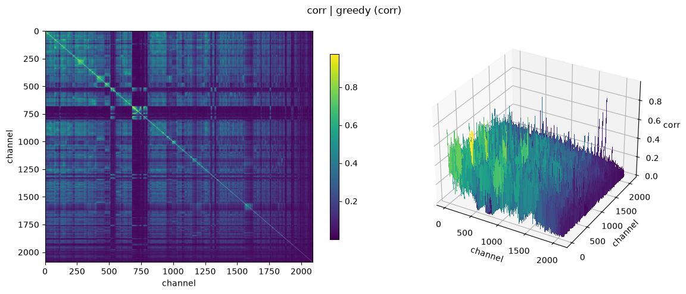
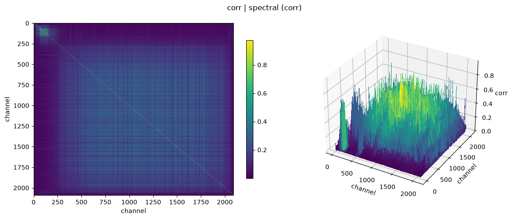
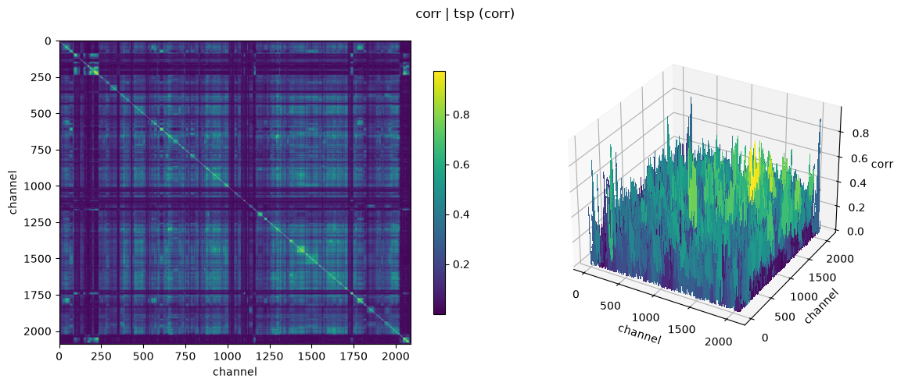

# data


<!-- WARNING: THIS FILE WAS AUTOGENERATED! DO NOT EDIT! -->

``` python
!uv pip install -q yfinance torch pandas numpy matplotlib tqdm
```

``` python
import matplotlib
matplotlib.use("Agg")
```

## Device

Every function here is device-agnostic – it inherits whatever device its
input tensor is already on. So the data is moved **once, as it comes off
disk** (`get_nyse_data(..., device=DEVICE)`), and the entire pipeline
follows it there with no further `.to()` calls anywhere. Same discipline
as whitening: do it once, at the start, then trust it.

Only the plotting functions force `.cpu()`, at the matplotlib boundary
where they have to. The `.pt` cache files are always written from CPU
copies, so they stay loadable on a machine with no GPU.

**Measured, warmed up** – ~2100 channels x 1003 days, RTX 5090:

<table>
<colgroup>
<col style="width: 25%" />
<col style="width: 25%" />
<col style="width: 25%" />
<col style="width: 25%" />
</colgroup>
<thead>
<tr>
<th>op</th>
<th>CPU</th>
<th>CUDA</th>
<th></th>
</tr>
</thead>
<tbody>
<tr>
<td><a
href="https://drscotthawley.github.io/shakeqr/data.html#corr_to_dist"><code>corr_to_dist</code></a></td>
<td>7.1 ms</td>
<td><strong>0.1 ms</strong></td>
<td>124x</td>
</tr>
<tr>
<td><a
href="https://drscotthawley.github.io/shakeqr/data.html#build_corr"><code>build_corr</code></a></td>
<td>14.9 ms</td>
<td><strong>0.8 ms</strong></td>
<td>20x</td>
</tr>
<tr>
<td><a
href="https://drscotthawley.github.io/shakeqr/data.html#build_xcorr"><code>build_xcorr</code></a>
(lag 20)</td>
<td>458.8 ms</td>
<td><strong>26.2 ms</strong></td>
<td>18x</td>
</tr>
<tr>
<td><a
href="https://drscotthawley.github.io/shakeqr/data.html#two_opt"><code>two_opt</code></a></td>
<td>528.4 ms</td>
<td><strong>37.6 ms</strong></td>
<td>14x</td>
</tr>
<tr>
<td><a
href="https://drscotthawley.github.io/shakeqr/data.html#spectral_order"><code>spectral_order</code></a></td>
<td>160.9 ms</td>
<td><strong>28.4 ms</strong></td>
<td>5.7x</td>
</tr>
<tr>
<td><a
href="https://drscotthawley.github.io/shakeqr/data.html#build_dist"><code>build_dist</code></a></td>
<td>64.7 ms</td>
<td><strong>12.9 ms</strong></td>
<td>5.0x</td>
</tr>
<tr>
<td><a
href="https://drscotthawley.github.io/shakeqr/data.html#greedy_edge_order"><code>greedy_edge_order</code></a></td>
<td>590.1 ms</td>
<td><strong>479.6 ms</strong></td>
<td>1.2x – mostly a serial Python union-find</td>
</tr>
<tr>
<td><a
href="https://drscotthawley.github.io/shakeqr/data.html#greedy_order"><code>greedy_order</code></a></td>
<td>18.0 ms</td>
<td>18.1 ms</td>
<td>a wash – latency-bound, N sequential syncing argmaxes</td>
</tr>
</tbody>
</table>

Every op is at least as fast on GPU, so nothing round-trips to CPU; each
simply inherits the device of its input.

**Warm up before timing anything here.** The first CUDA op in a process
pays one-time context initialization, which is large enough to
completely invert these conclusions: an unwarmed measurement showed
[`build_corr`](https://drscotthawley.github.io/shakeqr/data.html#build_corr)
at 156 ms (“slower than CPU!”) and
[`greedy_order`](https://drscotthawley.github.io/shakeqr/data.html#greedy_order)
at 383 ms (“20x slower!”), both pure startup cost rather than real work.

------------------------------------------------------------------------

<a
href="https://github.com/drscotthawley/shakeqr/blob/main/shakeqr/data.py#L29"
target="_blank" style="float:right; font-size:smaller">source</a>

### get_device

``` python
def get_device(
    prefer:NoneType=None
):
```

*cuda -\> mps (Apple Silicon) -\> cpu, unless `prefer` overrides.*

``` python
assert get_device("cpu").type == "cpu"
assert DEVICE.type in ("cuda", "mps", "cpu")
# a tensor moved to DEVICE must actually land there
assert torch.zeros(2, 2).to(DEVICE).device.type == DEVICE.type
print("DEVICE =", DEVICE)
```

    DEVICE = cuda

## Downloading

`pandas` appears only here, because `yfinance` hands back DataFrames.
Everything downstream is pure torch.

``` python
tks = _fetch_nyse_tickers()
assert len(tks) > 0
assert all("$" not in t for t in tks)
assert "^GSPC" not in tks           # prepended separately, by get_nyse_data
assert all(t == t.upper() for t in tks)
print(f"{len(tks)} tickers, e.g. {tks[:5]}")
```

    2197 tickers, e.g. ['A', 'AA', 'AADX', 'AAMI', 'AAP']

------------------------------------------------------------------------

<a
href="https://github.com/drscotthawley/shakeqr/blob/main/shakeqr/data.py#L58"
target="_blank" style="float:right; font-size:smaller">source</a>

### get_nyse_data

``` python
def get_nyse_data(
    cache_dir:str='~/github/shakeqr', years:int=4, chunk_size:int=100, force:bool=False,
    device:device=device(type='cpu')
):
```

*Daily open/close prices for NYSE common stocks plus the S&P 500 index*
prepended as channel 0. Returns `(opening, closing, tickers)` where the
price tensors are `[channels, days]` and `tickers` is aligned to the
channel axis. Cached to two `.pt` files; skips the download if present.

Tensors land on `device` immediately – the data goes to the GPU as it
comes off disk, and everything downstream simply inherits it. The `.pt`
cache is always written from CPU copies so the files stay portable.

``` python
opening, closing, tickers = get_nyse_data()
assert opening.shape == closing.shape
assert opening.shape[0] == len(tickers)
assert "^GSPC" in tickers
assert not torch.isnan(opening).all()
opening.shape, closing.shape, len(tickers)
```

    Cache hit -- skipping download. (device=cuda)

    (torch.Size([2195, 1003]), torch.Size([2195, 1003]), 2195)

## Cleaning

Two gaps to close before any correlation work:

- **Missing days** (holidays, halts, late IPOs) show up as `NaN`, which
  poison `corrcoef` and propagate through everything. Filled forward,
  then backward.
- **Penny stocks** are noise-dominated: a $0.50 stock moving to $0.55 is
  a 10% “return” that’s mostly bid-ask bounce. $5 is the SEC’s own
  threshold.

``` python
X = torch.tensor([[1., float("nan"), float("nan"), 4., float("nan")]])
filled = _ffill(X)
assert torch.equal(filled, torch.tensor([[1., 1., 1., 4., 4.]]))

# a leading NaN has nothing before it to carry forward -- ffill alone can't fix it
X2 = torch.tensor([[float("nan"), 2., 3.]])
assert torch.isnan(_ffill(X2)[0, 0])
print("ok")
```

    ok

------------------------------------------------------------------------

<a
href="https://github.com/drscotthawley/shakeqr/blob/main/shakeqr/data.py#L118"
target="_blank" style="float:right; font-size:smaller">source</a>

### fill_gaps

``` python
def fill_gaps(
    X
):
```

*Forward- then backward-fill NaNs along time. bfill == ffill reversed.*

Note: back-filling a ticker that didn’t exist yet paints its pre-IPO
period with its first real price – a convenience, not real history.

``` python
X = torch.tensor([[float("nan"), 2., float("nan"), float("nan"), 5.]])
filled = fill_gaps(X)
assert torch.equal(filled, torch.tensor([[2., 2., 2., 2., 5.]]))   # leading NaN backfilled

# cross-check against pandas ffill().bfill() on random data
torch.manual_seed(0)
Xr = torch.randn(3, 10)
Xr[torch.rand(3, 10) < 0.3] = float("nan")
ref = torch.tensor(pd.DataFrame(Xr.numpy().T).ffill().bfill().to_numpy().T, dtype=torch.float32)
mine = fill_gaps(Xr.clone())
both_nan = torch.isnan(mine) & torch.isnan(ref)
assert torch.allclose(mine[~both_nan], ref[~both_nan])
print("ok")
```

    ok

------------------------------------------------------------------------

<a
href="https://github.com/drscotthawley/shakeqr/blob/main/shakeqr/data.py#L126"
target="_blank" style="float:right; font-size:smaller">source</a>

### to_returns

``` python
def to_returns(
    opening, closing
):
```

*`[C, T]` prices -\> `[C, T]` intraday returns.*

``` python
op_ = torch.tensor([[100., 50.]])
cl_ = torch.tensor([[110., 45.]])
r = to_returns(op_, cl_)
assert torch.allclose(r, torch.tensor([[0.10, -0.10]]))
print("ok")
```

    ok

------------------------------------------------------------------------

<a
href="https://github.com/drscotthawley/shakeqr/blob/main/shakeqr/data.py#L131"
target="_blank" style="float:right; font-size:smaller">source</a>

### prepare

``` python
def prepare(
    opening, closing, tickers, min_mean_price:float=5.0, min_var:float=1e-12
):
```

*Fill gaps, drop penny stocks and zero-variance channels.* Returns
`(prices, returns, tickers)`, all mutually aligned. An `assert` at the
end catches channel/label drift – otherwise silent, and it’s the wrong
company attributed to every channel with no error raised.

``` python
# 4 synthetic channels: normal, penny stock (mean price < $5), zero-variance, normal
op = torch.tensor([[100., 101., 102., 103.],
                   [2., 2.1, 1.9, 2.0],
                   [50., 50., 50., 50.],
                   [10., 11., 9., 10.]])
cl = op + torch.tensor([[1., 1., 1., 1.],
                        [0.1, 0.1, 0.1, 0.1],
                        [0., 0., 0., 0.],
                        [0.5, -0.5, 0.5, -0.5]])
tks_ = ["A", "PENNY", "FLAT", "B"]
prices_, returns_, tk_ = prepare(op, cl, tks_)
assert tk_ == ["A", "B"]                    # PENNY (price) and FLAT (variance) both dropped
assert prices_.shape[0] == 2 and returns_.shape[0] == 2
print("ok:", tk_)
```

    ok: ['A', 'B']

## Orderings

Correlation is computed on **returns**, not prices. Raw price series are
non-stationary – everything trended up over four years, so a
price-correlation matrix mostly measures “the market went up” and comes
out near rank-1. Differencing removes the trend.

`use_abs=True` treats strongly *anti*-correlated channels as similar
too, which is arguably right for a fund (a hedge is as informative as a
twin) but does change what “adjacent” means.

Two orderings, solving genuinely different problems:

- **[`greedy_order`](https://drscotthawley.github.io/shakeqr/data.html#greedy_order)**
  – the anchored nearest-neighbour chain: from the S&P, hop to its
  most-correlated partner, then hop onward from *that* channel, and so
  on.
- **[`spectral_order`](https://drscotthawley.github.io/shakeqr/data.html#spectral_order)**
  – Fiedler-vector seriation, a global objective (approximately
  minimizing
  ∑<sub>*i**j*</sub>*C*<sub>*i**j*</sub>(*π*<sub>*i*</sub> − *π*<sub>*j*</sub>)<sup>2</sup>)
  with no anchor.

`torch.linalg.eigh` returns eigenvalues in *ascending* order, so
`evecs[:, 1]` is genuinely the Fiedler vector. Unshifted QR iteration
converges by *descending* magnitude, so taking column 1 from that gives
the second-largest mode – near noise for a Laplacian. (`eigh`
tridiagonalizes then runs QR internally, so this is still shakeQR under
the hood.)

------------------------------------------------------------------------

<a
href="https://github.com/drscotthawley/shakeqr/blob/main/shakeqr/data.py#L151"
target="_blank" style="float:right; font-size:smaller">source</a>

### build_corr

``` python
def build_corr(
    returns, use_abs:bool=True
):
```

*`[C, T]` returns -\> `[C, C]` Pearson correlation at zero lag.*

``` python
torch.manual_seed(0)
x = torch.randn(50)
noise = torch.randn(50) * 0.01
returns_ = torch.stack([x, x + noise, -x, torch.randn(50)])   # same, same+noise, opposite, independent
C_ = build_corr(returns_, use_abs=True)
assert C_[0, 1] > 0.95      # nearly identical
assert C_[0, 2] > 0.95      # opposite, but abs() treats it as close
assert C_[0, 3] < 0.5       # independent
assert torch.allclose(torch.diag(C_), torch.ones(4), atol=1e-4)
print("ok")
```

    ok

------------------------------------------------------------------------

<a
href="https://github.com/drscotthawley/shakeqr/blob/main/shakeqr/data.py#L157"
target="_blank" style="float:right; font-size:smaller">source</a>

### greedy_order

``` python
def greedy_order(
    C, start:int=0
):
```

*Anchored nearest-neighbour chain. Each step re-anchors on the channel*
just placed, so `start` seeds only the first hop.

Inherits `C`’s device like everything else. This one is latency-bound
rather than throughput-bound (N sequential argmaxes, each `int()`
forcing a sync), so it’s the natural candidate for running on CPU
instead – but measured at ~2100 channels it’s a wash: 18.0 ms CPU vs
18.1 ms CUDA, and an explicit round-trip to CPU came out slightly
*worse* at 18.8 ms. Not worth the special case.

``` python
# hand-built chain structure: 0 closest to 1, then 2, then 3
C_ = torch.tensor([[1.00, 0.90, 0.10, 0.05],
                   [0.90, 1.00, 0.80, 0.05],
                   [0.10, 0.80, 1.00, 0.70],
                   [0.05, 0.05, 0.70, 1.00]])
order = greedy_order(C_, start=0)
assert sorted(order.tolist()) == [0, 1, 2, 3]
assert order.tolist() == [0, 1, 2, 3]
print("ok:", order.tolist())
```

    ok: [0, 1, 2, 3]

------------------------------------------------------------------------

<a
href="https://github.com/drscotthawley/shakeqr/blob/main/shakeqr/data.py#L178"
target="_blank" style="float:right; font-size:smaller">source</a>

### spectral_order

``` python
def spectral_order(
    C, anchor:int=0
):
```

*Fiedler-vector seriation of the graph Laplacian L = D - C.*

``` python
C_ = torch.tensor([[1.00, 0.90, 0.10, 0.05],
                   [0.90, 1.00, 0.80, 0.05],
                   [0.10, 0.80, 1.00, 0.70],
                   [0.05, 0.05, 0.70, 1.00]])
order = spectral_order(C_, anchor=0)
assert sorted(order.tolist()) == [0, 1, 2, 3]
print("ok:", order.tolist())
```

    ok: [0, 1, 2, 3]

## Lag-aware pairing (cross-correlation)

[`build_corr`](https://drscotthawley.github.io/shakeqr/data.html#build_corr)
measures correlation at a single instant – lag (shift) zero. But two
channels can be genuinely related with one leading the other by a few
days (one reacts to news first, the other catches up) – zero-lag
correlation would score that pair as unrelated even though a real
relationship exists at some nonzero shift.

[`build_xcorr`](https://drscotthawley.github.io/shakeqr/data.html#build_xcorr)
generalizes: for every pair, compute the correlation at every shift tau
in `[-max_lag, max_lag]` and keep the maximum.
[`build_corr`](https://drscotthawley.github.io/shakeqr/data.html#build_corr)
is exactly the `max_lag=0` special case. **The shift is only used to
measure this metric – nothing downstream ever actually shifts the data
itself**; it stays as originally sampled, day-aligned with every other
channel.

**Small-overlap shifts are discounted, not renormalized away.** At large
`|tau|` the overlap window shrinks – naively *renormalizing* each
shift’s score by its own (shrinking) overlap size lets a tiny, noisy
window reach a spuriously high score just as easily as a full-length
one, and taking the max over ~2000 candidate shifts will reliably find
one. Confirmed empirically: on real data, searching the full timeline
this way pushed the *mean* cross-correlation across 2092 channels to
0.978 – not a finding, a multiple-comparisons artifact. The fix: divide
every shift’s score by the same **fixed** `T-1` (the full series length)
rather than its own shrinking overlap `n`. At `tau=0`, `n=T-1`, so this
is exactly the ordinary correlation; at extreme shifts, the numerator
only has a few terms to sum but still divides by the full `T-1`, so the
score is automatically discounted toward zero instead of spuriously
inflated. Re-checked on the same real data after the fix: full-timeline
mean stayed close to the zero-lag baseline, no blowup.

Like
[`build_dist`](https://drscotthawley.github.io/shakeqr/data.html#build_dist),
this expects **already-whitened** input – whitening happens exactly
once, early in the pipeline (`returns_w = standardize(returns)`), and
every downstream function trusts that single pass rather than
re-whitening its own input.

This is `O((2 max_lag + 1) * C^2 * T)` – one matmul-shaped correlation
computation per candidate shift, each `O(C^2 T)`. Real cost, which is
exactly why it’s plain torch ops rather than a python double-loop over
pairs – device defaults to CUDA, falling back to MPS (Apple Silicon),
falling back to CPU.

------------------------------------------------------------------------

<a
href="https://github.com/drscotthawley/shakeqr/blob/main/shakeqr/data.py#L188"
target="_blank" style="float:right; font-size:smaller">source</a>

### build_xcorr

``` python
def build_xcorr(
    returns, max_lag:int=20, use_abs:bool=True, device:NoneType=None
):
```

*`[C, T]` returns -\> `[C, C]` matrix of MAXIMUM cross-correlation-like*
score over shifts `tau` in `[-max_lag, max_lag]`
([`build_corr`](https://drscotthawley.github.io/shakeqr/data.html#build_corr)
is the `tau=0` special case). `max_lag=None` searches the *entire*
timeline (`tau` up to `T-1` either direction).

Each shift’s score is divided by the FIXED full series length `T-1`, not
the shrinking per-shift overlap `n` – at `tau=0`, `n=T-1` so this is
exactly the standard correlation; at extreme shifts, the numerator only
has a handful of terms to sum but still divides by the full `T-1`, so
the score is naturally discounted toward zero rather than spuriously
reaching +-1 on a tiny sample the way per-shift normalization would.

Like
[`build_dist`](https://drscotthawley.github.io/shakeqr/data.html#build_dist),
expects **already-whitened** input (unit variance, zero mean per
channel) – this scaling only behaves like a correlation on whitened
data. Whitening happens exactly once, early in the pipeline
(`returns_w = standardize(returns)`); every downstream function,
including this one, trusts that single pass rather than re-whitening its
own input.

Stays on the input’s device by default (pass `device=` to force one). It
deliberately does NOT copy the result back to CPU – doing so would
silently drag the whole downstream pipeline off the GPU.

``` python
def _whiten_once_early(X, eps=1e-8):
    """Whiten exactly once, right after data is created -- the same
    convention the real pipeline follows (`returns_w = standardize(returns)`),
    so every test below feeds build_xcorr what it actually expects."""
    return (X - X.mean(dim=1, keepdim=True)) / (X.std(dim=1, keepdim=True) + eps)

# 1. max_lag=0 degenerates exactly to zero-lag correlation
torch.manual_seed(1)
R = _whiten_once_early(torch.randn(6, 50))
assert torch.allclose(build_xcorr(R, max_lag=0, device="cpu"), build_corr(R), atol=1e-4)

# 1b. max_lag=None means "search the whole timeline" -- exactly T-1
assert torch.allclose(build_xcorr(R, max_lag=None, device="cpu"),
                      build_xcorr(R, max_lag=R.shape[1] - 1, device="cpu"), atol=1e-4)

# 2. the definitive test: detects a lagged relationship zero-lag correlation misses
T = 200
x = torch.randn(T)
y = torch.roll(x, shifts=7)
y[:7] = torch.randn(7)                      # kill the wraparound so it can't fake the match
R2 = _whiten_once_early(torch.stack([x, y]))
zero_lag = build_corr(R2)[0, 1].item()
too_narrow = build_xcorr(R2, max_lag=2, device="cpu")[0, 1].item()
wide_enough = build_xcorr(R2, max_lag=10, device="cpu")[0, 1].item()
assert zero_lag < 0.3, "zero-lag correlation should look weak for this pair"
assert wide_enough > 0.9, "max cross-correlation should find the near-perfect match once shift=7 is in range"
assert wide_enough > too_narrow + 0.3
print(f"ok: zero-lag={zero_lag:.3f}, max_lag=2 -> {too_narrow:.3f}, max_lag=10 -> {wide_enough:.3f}")

# 3. regression test for the small-overlap blowup this scaling fixes: pure
#    independent noise must NOT approach saturation (~1) under a full-timeline
#    search, even though naive per-shift normalization would (verified: it
#    reached 0.978 MEAN -- not max, mean -- on real data before this fix).
#    An absolute ceiling, not a ratio to baseline: taking a max over ~300
#    shifts naturally inflates the mean somewhat vs. a single zero-lag sample
#    (ordinary extreme-value statistics) -- that alone isn't the bug: what
#    the fix actually prevents is the mean approaching the 0.9+ saturation
#    the broken version showed.
Rn = _whiten_once_early(torch.randn(30, 150))   # independent channels, no real relationship
baseline = build_corr(Rn).fill_diagonal_(0).mean().item()
full_scan = build_xcorr(Rn, max_lag=None, device="cpu").fill_diagonal_(0)
assert full_scan.mean().item() < 0.5, "full-timeline search should not approach saturation on pure noise"
print(f"ok: noise baseline={baseline:.3f}, full-timeline mean={full_scan.mean().item():.3f} (no blowup)")

# 4. stays on the input's device -- must NOT silently drag results back to CPU,
#    which would pull the whole downstream pipeline off the GPU
Rdev = Rn.to(DEVICE)
assert build_xcorr(Rdev, max_lag=3).device.type == DEVICE.type
assert build_corr(Rdev).device.type == DEVICE.type
print(f"ok: device passthrough ({DEVICE.type})")
```

    ok: zero-lag=0.227, max_lag=2 -> 0.227, max_lag=10 -> 0.986
    ok: noise baseline=0.061, full-timeline mean=0.203 (no blowup)
    ok: device passthrough (cuda)

------------------------------------------------------------------------

<a
href="https://github.com/drscotthawley/shakeqr/blob/main/shakeqr/data.py#L232"
target="_blank" style="float:right; font-size:smaller">source</a>

### corr_to_dist

``` python
def corr_to_dist(
    C
):
```

*Generic correlation -\> RMS-distance conversion (on whitened data,* d^2
= 2(1-corr)) – works for any \[C,C\] correlation-like matrix, whether
from
[`build_corr`](https://drscotthawley.github.io/shakeqr/data.html#build_corr)
(lag 0) or
[`build_xcorr`](https://drscotthawley.github.io/shakeqr/data.html#build_xcorr)
(max over lags).

``` python
def _standardize_for_test(X, eps=1e-8):
    return (X - X.mean(dim=1, keepdim=True)) / (X.std(dim=1, keepdim=True) + eps)

torch.manual_seed(2)
Rw = _standardize_for_test(torch.randn(8, 300))
C_signed = build_corr(Rw, use_abs=False)
D_from_corr = corr_to_dist(C_signed)
# cross-check against a direct, independent RMS-distance computation
D_direct = torch.cdist(Rw.unsqueeze(0), Rw.unsqueeze(0)).squeeze(0) / (Rw.shape[1] ** 0.5)
assert torch.allclose(D_from_corr, D_direct, atol=0.01)

# device passthrough: must not drag the pipeline back to CPU
assert corr_to_dist(build_corr(Rw.to(DEVICE))).device.type == DEVICE.type
print("ok")
```

    ok

## TSP ordering

[`greedy_order`](https://drscotthawley.github.io/shakeqr/data.html#greedy_order)
and
[`spectral_order`](https://drscotthawley.github.io/shakeqr/data.html#spectral_order)
both optimize **correlation**. But the thing we’re actually measuring
([`roughness`](https://drscotthawley.github.io/shakeqr/data.html#roughness),
below) is **raw-scale L1 difference between adjacent channels** – and
those are not the same objective. Two channels can be strongly
correlated with wildly different variances, so a correlation-maximizing
order can still leave real roughness on the table. This section targets
the actual metric directly, and treats “order the channels for minimum
adjacent difference” as what it structurally is: an **open-path TSP**,
with distance = expected roughness between each pair.

[`build_dist`](https://drscotthawley.github.io/shakeqr/data.html#build_dist)
gets the `[C, C]` RMS-distance matrix in `O(C^2)` via the variance
identity `E[(X-Y)^2] = Var(X) + Var(Y) - 2 Cov(X,Y) + (mu_X - mu_Y)^2`,
rather than materializing an `O(C^2 T)` tensor – computed in float64
since the identity subtracts two similarly-sized terms (cancellation),
which is noticeably lossy in float32 for a one-time, cheap `O(C^2)` op.
It’s specifically the zero-lag shortcut;
[`corr_to_dist`](https://drscotthawley.github.io/shakeqr/data.html#corr_to_dist)
(above) is the generic version that also works with
[`build_xcorr`](https://drscotthawley.github.io/shakeqr/data.html#build_xcorr)’s
output.

Two-stage solve, both textbook TSP heuristics:

- **[`greedy_edge_order`](https://drscotthawley.github.io/shakeqr/data.html#greedy_edge_order)**
  – Kruskal-style construction: sort every edge by distance ascending,
  add it if it doesn’t exceed degree 2 or close a premature cycle.
  Generally beats nearest-neighbor construction (what
  [`greedy_order`](https://drscotthawley.github.io/shakeqr/data.html#greedy_order)
  above does), since it isn’t locked into decisions made early from an
  arbitrary start.
- **[`two_opt`](https://drscotthawley.github.io/shakeqr/data.html#two_opt)**
  – local search refinement: repeatedly reverse a tour segment whenever
  doing so shortens it, until no improving reversal exists. Uses the
  standard trick of closing the open path into a cycle through a
  zero-cost phantom node, so ordinary cyclic 2-opt applies unmodified.

**Important: distances must come from whitened returns, not raw ones.**
Unlike correlation, RMS distance is *not* scale-invariant – feed it raw
returns and a handful of high-variance channels will dominate the tour
regardless of genuine co-movement, for the same reason raw-scale
[`roughness`](https://drscotthawley.github.io/shakeqr/data.html#roughness)
can be misleading. Whiten first
([`standardize`](https://drscotthawley.github.io/shakeqr/data.html#standardize),
zero mean/unit variance per channel, along time): once
`Var_i = Var_j = 1` and `mu_i = mu_j = 0`, the identity above collapses
to

*d*<sub>*i**j*</sub><sup>2</sup> = 2(1 − corr<sub>*i**j*</sub>)

which is a clarifying fact, not just a formula: on whitened returns,
TSP-based ordering solves the *exact same underlying objective* as
[`greedy_order`](https://drscotthawley.github.io/shakeqr/data.html#greedy_order)
and
[`spectral_order`](https://drscotthawley.github.io/shakeqr/data.html#spectral_order)
(closeness = correlation) – it just solves it with a substantially
stronger algorithm (greedy-edge construction + 2-opt) than
nearest-neighbor construction or a spectral relaxation.

------------------------------------------------------------------------

<a
href="https://github.com/drscotthawley/shakeqr/blob/main/shakeqr/data.py#L239"
target="_blank" style="float:right; font-size:smaller">source</a>

### build_dist

``` python
def build_dist(
    returns
):
```

*`[C, T]` returns -\> `[C, C]` RMS distance between channels. The*
zero-lag-specific fast path; see
[`corr_to_dist`](https://drscotthawley.github.io/shakeqr/data.html#corr_to_dist)
for the generic version.

Uses float64 for the variance identity (it subtracts two similarly-sized
terms, so float32 cancellation is measurable) – except on MPS, which has
no float64 support at all and would raise; there it falls back to
float32 and eats the precision loss.

``` python
torch.manual_seed(3)
R = torch.randn(5, 20)
D_ = build_dist(R)
brute = torch.zeros(5, 5)
for i in range(5):
    for j in range(5):
        brute[i, j] = ((R[i] - R[j]) ** 2).mean().sqrt()
assert torch.allclose(D_, brute, atol=1e-3)
print("ok")
```

    ok

------------------------------------------------------------------------

<a
href="https://github.com/drscotthawley/shakeqr/blob/main/shakeqr/data.py#L258"
target="_blank" style="float:right; font-size:smaller">source</a>

### greedy_edge_order

``` python
def greedy_edge_order(
    D
):
```

*Greedy-edge TSP construction (Kruskal-style union-find).*

``` python
torch.manual_seed(4)
D_ = torch.rand(10, 10); D_ = (D_ + D_.T) / 2; D_.fill_diagonal_(0)
order = greedy_edge_order(D_)
assert sorted(order.tolist()) == list(range(10))
naive_len = D_[torch.arange(9), torch.arange(1, 10)].sum()
greedy_len = D_[order[:-1], order[1:]].sum()
assert greedy_len <= naive_len + 1e-6
print("ok")
```

    ok

------------------------------------------------------------------------

<a
href="https://github.com/drscotthawley/shakeqr/blob/main/shakeqr/data.py#L300"
target="_blank" style="float:right; font-size:smaller">source</a>

### tour_length

``` python
def tour_length(
    D, order
):
```

*Total length of an open-path tour – the quantity 2-opt minimizes.*

``` python
D_ = torch.tensor([[0., 1., 5.], [1., 0., 2.], [5., 2., 0.]])
order = torch.tensor([0, 1, 2])
assert abs(tour_length(D_, order) - 3.0) < 1e-6      # 0->1 (1) + 1->2 (2)
print("ok")
```

    ok

------------------------------------------------------------------------

<a
href="https://github.com/drscotthawley/shakeqr/blob/main/shakeqr/data.py#L305"
target="_blank" style="float:right; font-size:smaller">source</a>

### two_opt

``` python
def two_opt(
    D, order, max_passes:int=30, tol:float=1e-09
):
```

*Full vectorized 2-opt on an open path, via the standard trick of*
closing it into a cycle through a zero-cost phantom node.

``` python
# never worsens, stays a valid permutation
torch.manual_seed(5)
D_ = torch.rand(15, 15); D_ = (D_ + D_.T) / 2; D_.fill_diagonal_(0)
order0 = greedy_edge_order(D_)
len0 = tour_length(D_, order0)
order1 = two_opt(D_, order0.clone())
assert sorted(order1.tolist()) == list(range(15))
assert tour_length(D_, order1) <= len0 + 1e-6

# regression test for a real bug hit during development: an unravel-index error
# (dividing by the wrong tensor dimension) silently accepted a non-improving
# move as if none existed. Hand-built case with an obvious improving swap:
D2 = torch.tensor([[0., 1., 9., 9.],
                   [1., 0., 9., 2.],
                   [9., 9., 0., 1.],
                   [9., 2., 1., 0.]])
crossed = torch.tensor([0, 2, 1, 3])        # deliberately bad: edges (0,2)=9, (2,1)=9
fixed = two_opt(D2, crossed.clone())
assert tour_length(D2, fixed) < tour_length(D2, crossed)
print("ok")
```

    ok

------------------------------------------------------------------------

<a
href="https://github.com/drscotthawley/shakeqr/blob/main/shakeqr/data.py#L337"
target="_blank" style="float:right; font-size:smaller">source</a>

### tsp_order

``` python
def tsp_order(
    returns, max_passes:int=30
):
```

*Greedy-edge construction + 2-opt refinement, targeting
[`roughness`](https://drscotthawley.github.io/shakeqr/data.html#roughness)*
directly rather than correlation. Zero-lag only (uses
[`build_dist`](https://drscotthawley.github.io/shakeqr/data.html#build_dist));
for the cross-correlation metric, build `D` via
`corr_to_dist(build_xcorr(...))` and call
`two_opt(D, greedy_edge_order(D))` directly. Returns `(order, D)`.

``` python
torch.manual_seed(6)
R = torch.randn(8, 30)
order, D_ = tsp_order(R)
assert sorted(order.tolist()) == list(range(8))
ge_len = tour_length(D_, greedy_edge_order(D_))
assert tour_length(D_, order) <= ge_len + 1e-6      # refinement shouldn\'t be worse than construction alone
print("ok")
```

    ok

## Diagnostics

Judge an ordering by what we actually want from it: smoothness along the
channel axis. The mean alone is misleading, though – greedy *maximizes*
local adjacent correlation by construction, so it can win on the mean
while being far worse in practice. It burns the good matches early and
strands the leftovers, so quality degrades monotonically: excellent for
the first stretch, garbage in the tail.

For conv or patch-based representation learning, uniformly-mediocre
beats great-then-terrible, since non-stationary channel statistics make
learned cross-channel features unreliable. Hence the per-block profile.

**[`roughness`](https://drscotthawley.github.io/shakeqr/data.html#roughness)
must be measured on whitened returns, not raw ones**, for the same
reason distances need whitened input: on raw returns, a handful of
high-variance channels dominate the number regardless of genuine
co-movement, so “lower roughness” can just mean “avoided the loud
channels” rather than “found real structure.”

------------------------------------------------------------------------

<a
href="https://github.com/drscotthawley/shakeqr/blob/main/shakeqr/data.py#L347"
target="_blank" style="float:right; font-size:smaller">source</a>

### roughness

``` python
def roughness(
    X, order:NoneType=None
):
```

*Mean total variation between adjacent channels. Lower = smoother.*

``` python
X = torch.tensor([[0., 0.], [1., 1.], [3., 3.]])
assert abs(roughness(X) - 1.5) < 1e-6                # |1-0|=1, |3-1|=2 -> mean 1.5
order = torch.tensor([2, 0, 1])                      # reorder to 3,0,1 -> |0-3|=3, |1-0|=1 -> mean 2.0
assert abs(roughness(X, order) - 2.0) < 1e-6
print("ok")
```

    ok

------------------------------------------------------------------------

<a
href="https://github.com/drscotthawley/shakeqr/blob/main/shakeqr/data.py#L353"
target="_blank" style="float:right; font-size:smaller">source</a>

### roughness_profile

``` python
def roughness_profile(
    X, order, n_blocks:int=10
):
```

*Per-position roughness – reveals non-uniformity that the mean hides.*

``` python
X = torch.arange(20).float().unsqueeze(1).repeat(1, 3)   # 20 channels, constant across "days", values 0..19
prof = roughness_profile(X, torch.arange(20), n_blocks=4)
assert len(prof) == 4
assert all(abs(p - 1.0) < 1e-6 for p in prof)             # adjacent channels always differ by exactly 1
print("ok:", prof)
```

    ok: [1.0, 1.0, 1.0, 1.0]

------------------------------------------------------------------------

<a
href="https://github.com/drscotthawley/shakeqr/blob/main/shakeqr/data.py#L359"
target="_blank" style="float:right; font-size:smaller">source</a>

### chain_trace

``` python
def chain_trace(
    C, order, tickers, n:int=8
):
```

*Print the pairs the chain actually maximized, hop by hop.*

``` python
import io as _io, contextlib

C_ = torch.eye(3) + 0.1
order = torch.tensor([0, 1, 2])
tks_ = ["AAA", "BBB", "CCC"]
buf = _io.StringIO()
with contextlib.redirect_stdout(buf):
    chain_trace(C_, order, tks_, n=2)
out = buf.getvalue()
assert "AAA -> BBB" in out and "BBB -> CCC" in out
print("ok")
```

    ok

------------------------------------------------------------------------

<a
href="https://github.com/drscotthawley/shakeqr/blob/main/shakeqr/data.py#L367"
target="_blank" style="float:right; font-size:smaller">source</a>

### corr_stats

``` python
def corr_stats(
    C, orders
):
```

*`orders`: dict of name -\> order tensor.*

``` python
import io as _io, contextlib

C_ = torch.eye(3) + 0.1
buf = _io.StringIO()
with contextlib.redirect_stdout(buf):
    corr_stats(C_, {"test_order": torch.tensor([0, 1, 2])})
out = buf.getvalue()
assert "mean |corr|" in out and "test_order" in out
print("ok")
```

    ok

## Plotting

Per-channel standardization is a *visualization* fix only – correlation
is invariant under per-channel affine transforms, so the orderings are
unaffected and need no recompute.

Two things that decide whether these plots show anything:

- **A contiguous channel slice, not a stride.** `[::20]` puts channels
  20 apart in the ordering next to each other on screen, destroying
  exactly the local continuity we’re looking for and making every
  ordering look equally noisy. To see the global picture instead,
  mean-pool the channel axis – pooling preserves continuity, subsampling
  discards it.
- **Clipping.** Standardizing equalizes variance but doesn’t remove
  outliers; one 20-sigma spike eats the whole color range and flattens
  everything else.

[`show_corr`](https://drscotthawley.github.io/shakeqr/data.html#show_corr)
is the definitive seriation check: a working ordering makes the permuted
correlation matrix visibly banded, high near the diagonal.

**Rasterized, not interactive.** Both
[`show`](https://drscotthawley.github.io/shakeqr/data.html#show) and
[`show_corr`](https://drscotthawley.github.io/shakeqr/data.html#show_corr)
render two static matplotlib views side by side – a top-down heatmap
(`imshow`) and a 3D surface (`mplot3d`) – rather than an embedded-data
interactive widget. The tradeoff: no live rotation, but a fixed small
output size (tens-hundreds of KB) regardless of channel count, since
rasterizing to pixels discards the raw data rather than shipping all of
it to the browser. A full
[`show_corr`](https://drscotthawley.github.io/shakeqr/data.html#show_corr)
over all ~2100 channels was 91MB as an embedded-data interactive plot;
the matplotlib equivalent renders in well under a second either way.

------------------------------------------------------------------------

<a
href="https://github.com/drscotthawley/shakeqr/blob/main/shakeqr/data.py#L379"
target="_blank" style="float:right; font-size:smaller">source</a>

### standardize

``` python
def standardize(
    X, eps:float=1e-08
):
```

*Zero mean, unit variance per channel (along time).*

``` python
X = torch.tensor([[1., 2., 3., 4., 5.]])
Xs = standardize(X)
assert abs(Xs.mean().item()) < 1e-6
assert abs(Xs.std(unbiased=True).item() - 1.0) < 1e-4
print("ok")
```

    ok

------------------------------------------------------------------------

<a
href="https://github.com/drscotthawley/shakeqr/blob/main/shakeqr/data.py#L384"
target="_blank" style="float:right; font-size:smaller">source</a>

### log_prices

``` python
def log_prices(
    prices
):
```

*Standardized log-prices. `clamp_min` guards against a stray zero or*
negative price, which would give -inf and NaN out the whole channel.

``` python
prices_ = torch.tensor([[1., 2., 4., 8.]])
lp = log_prices(prices_)
assert not torch.isnan(lp).any()

bad_prices = torch.tensor([[0., 1., -5., 2.]])          # zero and negative -- would be -inf/NaN unguarded
assert torch.isfinite(log_prices(bad_prices)).all()
print("ok")
```

    ok

``` python
import matplotlib.pyplot as plt

x = np.arange(5); y = np.arange(4)
Z = np.random.randn(4, 5)
fig = _two_panel(x, y, Z, "test", "x", "y", "z")
assert isinstance(fig, plt.Figure)
print("ok")
```

    ok

------------------------------------------------------------------------

<a
href="https://github.com/drscotthawley/shakeqr/blob/main/shakeqr/data.py#L418"
target="_blank" style="float:right; font-size:smaller">source</a>

### show

``` python
def show(
    X, title, n_ch:NoneType=None, t_stride:int=5, clip:float=3.0, cmap:str='viridis'
):
```

*Two static views over ALL channels by default (`n_ch=None`); x is in*
real days. `t_stride` controls point density on the day axis.

``` python
import matplotlib.pyplot as plt

X = torch.randn(6, 30)
fig = show(X, "test")
assert isinstance(fig, plt.Figure)
print("ok")
```

    ok

------------------------------------------------------------------------

<a
href="https://github.com/drscotthawley/shakeqr/blob/main/shakeqr/data.py#L428"
target="_blank" style="float:right; font-size:smaller">source</a>

### show_corr

``` python
def show_corr(
    C, order, title, n:NoneType=None, cmap:str='viridis'
):
```

*Correlation matrix permuted by `order` – banded means it worked.* ALL
channels by default (`n=None`). Diagonal (self-correlation, always
exactly 1) is masked to NaN – it’s trivial and dominates the color/
height scale otherwise; NaN reads as “excluded,” not as a real value the
way 0 would.

``` python
import matplotlib.pyplot as plt

C_ = torch.rand(6, 6); C_ = (C_ + C_.T) / 2; C_.fill_diagonal_(1.0)
order = torch.arange(6)
fig = show_corr(C_, order, "test")
assert isinstance(fig, plt.Figure)
print("ok")
```

    ok

### Per-position score profile

[`corr_stats`](https://drscotthawley.github.io/shakeqr/data.html#corr_stats)
already computes `C[o[:-1], o[1:]]` – the score between each channel and
its immediate predecessor in a given ordering – but only reports block
averages. Plotted at full per-position resolution instead, this is the
direct picture of “what did each ordering actually pay to place channel
*k* here.”

Channel 0 has no predecessor, so the line starts at position 1. For
`greedy`, which explicitly maximizes this exact score at every step,
expect a decline as the best candidates get used up first – worth
checking whether it’s a gentle slope or a genuine cliff, since a cliff
would mark a natural cutoff for truncating the ordering rather than
keeping the whole tail of forced, low-quality pairings.

------------------------------------------------------------------------

<a
href="https://github.com/drscotthawley/shakeqr/blob/main/shakeqr/data.py#L442"
target="_blank" style="float:right; font-size:smaller">source</a>

### show_score_profile

``` python
def show_score_profile(
    C, orders, title:str='pairing score by position', sort_desc:bool=False
):
```

*Stacked subplots, one row per ordering, of `C[o[:-1], o[1:]]` (score*
vs. immediate predecessor). Default: plotted in positional order (as
encountered walking the ordering) – shows *where* quality holds up or
collapses. `sort_desc=True` instead sorts each ordering’s own scores
independently from highest to lowest – most-correlated-left,
least-correlated-right – decoupled from position, useful for a clean
side-by-side of how gently or sharply each method’s quality decays
overall. `orders`: dict of name -\> order tensor, same convention as
[`corr_stats`](https://drscotthawley.github.io/shakeqr/data.html#corr_stats).
Each row gets its own color from the standard cycle (each Axes otherwise
resets to color 0 independently, so every row would default to the same
blue).

``` python
import matplotlib.pyplot as plt

# hand-built: score should be exactly the chain\'s known adjacent values
C_ = torch.tensor([[1.00, 0.90, 0.10, 0.05],
                   [0.90, 1.00, 0.80, 0.05],
                   [0.10, 0.80, 1.00, 0.70],
                   [0.05, 0.05, 0.70, 1.00]])
order = torch.tensor([0, 1, 2, 3])
fig = show_score_profile(C_, {"chain": order})
assert isinstance(fig, plt.Figure)
assert len(fig.axes) == 1                                        # one row per ordering
line = fig.axes[0].lines[0]
assert list(line.get_xdata()) == [1, 2, 3]                       # positions 1..N-1, channel 0 excluded
assert torch.allclose(torch.tensor(line.get_ydata()), torch.tensor([0.90, 0.80, 0.70]), atol=1e-4)

fig2 = show_score_profile(C_, {"a": order, "b": order.flip(0)})
assert len(fig2.axes) == 2                                       # two orderings -> two rows
color_a = fig2.axes[0].lines[0].get_color()
color_b = fig2.axes[1].lines[0].get_color()
assert color_a != color_b                                        # each row its own color, not all default blue

# sort_desc=True: same multiset of values, just monotonically non-increasing
fig3 = show_score_profile(C_, {"chain": order}, sort_desc=True)
sorted_line = fig3.axes[0].lines[0].get_ydata()
assert all(sorted_line[i] >= sorted_line[i + 1] for i in range(len(sorted_line) - 1))   # non-increasing
assert torch.allclose(torch.tensor(sorted(sorted_line, reverse=True)),
                      torch.tensor(sorted([0.90, 0.80, 0.70], reverse=True)), atol=1e-4)
print("ok")
```

    ok

## Pipeline

One plot per cell – boopiter renders a cell’s final value, not a stream
of `display()` calls.

**`PAIRING` is the switch requested:** `"corr"` (zero-lag) or `"xcorr"`
(max over shifts). It controls the `[C, C]` similarity matrix that
*everything* below it consumes –
[`greedy_order`](https://drscotthawley.github.io/shakeqr/data.html#greedy_order),
[`spectral_order`](https://drscotthawley.github.io/shakeqr/data.html#spectral_order),
and the TSP distance (via
[`corr_to_dist`](https://drscotthawley.github.io/shakeqr/data.html#corr_to_dist))
all just take whatever `C` this produces, agnostic to which metric built
it.

``` python
PAIRING = "corr"   # "corr" (zero-lag) or "xcorr" (max cross-correlation over shifts)
XCORR_MAX_LAG = 20  # only used when PAIRING == "xcorr"; None = search the entire timeline
```

``` python
prices, returns, tk = prepare(opening, closing, tickers)
# already on DEVICE (get_nyse_data put it there); just whiten, once
returns_w = standardize(returns)

if PAIRING == "corr":
    C = build_corr(returns_w)
elif PAIRING == "xcorr":
    C = build_xcorr(returns_w, max_lag=XCORR_MAX_LAG)
else:
    raise ValueError(f"PAIRING must be 'corr' or 'xcorr', got {PAIRING!r}")

D = corr_to_dist(C)

order_g = greedy_order(C, start=0)
order_s = spectral_order(C, anchor=0)
order_t = two_opt(D, greedy_edge_order(D))

print(f"PAIRING={PAIRING!r}, {len(tk)} channels, {prices.shape[1]} days, device={C.device}\n")
corr_stats(C, {"greedy": order_g, "spectral": order_s, "tsp": order_t})
```

    PAIRING='corr', 2092 channels, 1003 days, device=cuda:0

    mean |corr|:      0.168
    max off-diagonal: 0.973
    S&P best match:   0.752   (first hop only)
    greedy    adjacent corr -- mean 0.496, first10 0.639, last10 0.057
    spectral  adjacent corr -- mean 0.217, first10 0.026, last10 0.027
    tsp       adjacent corr -- mean 0.506, first10 0.161, last10 0.167

``` python
chain_trace(C, order_g, tk)
```

    ch  0 ->  1: 0.752   A -> WAT
    ch  1 ->  2: 0.721   WAT -> MTD
    ch  2 ->  3: 0.672   MTD -> TMO
    ch  3 ->  4: 0.769   TMO -> DHR
    ch  4 ->  5: 0.651   DHR -> RVTY
    ch  5 ->  6: 0.613   RVTY -> BIO
    ch  6 ->  7: 0.568   BIO -> AVTR
    ch  7 ->  8: 0.528   AVTR -> IQV

``` python
print(f"original: {roughness(returns_w):.5f}")
for name, o in [("greedy", order_g), ("spectral", order_s), ("tsp", order_t)]:
    prof = [f"{v:.4f}" for v in roughness_profile(returns_w, o)]
    print(f"{name:9s} {roughness(returns_w, o):.5f}   profile: {prof}")
```

    original: 0.92685
    greedy    0.70633   profile: ['0.5971', '0.5875', '0.6610', '0.5862', '0.6672', '0.7283', '0.7681', '0.8205', '0.8246', '0.8234']
    spectral  0.91061   profile: ['0.7927', '0.9834', '0.9400', '0.9024', '0.8987', '0.8914', '0.9063', '0.9068', '0.9376', '0.9476']
    tsp       0.69495   profile: ['0.6602', '0.7365', '0.7328', '0.7102', '0.7015', '0.7565', '0.6427', '0.6388', '0.7293', '0.6412']

`tsp` targets
[`roughness`](https://drscotthawley.github.io/shakeqr/data.html#roughness)
directly (rather than correlation as a proxy for it), so it’s the one to
expect winning on that number – worth checking it actually does before
trusting it over the other two.

**Before the surface plots** – a cheap, fine-grained look at the same
claim. `greedy`’s score is exactly what it maximized at each step, so
its row is the direct picture of “burns the best matches early.”
`spectral` and `tsp` didn’t literally pick channels by this criterion
step-by-step, but the same score at their final positions is still the
natural, comparable measure of “how good was this neighbor” – worth
reading as a foreshadowing of what the surface plots below should show,
not just a confirmation after the fact.

``` python
show_score_profile(C, {'greedy': order_g, 'spectral': order_s, 'tsp': order_t}, title=f"pairing score ({PAIRING}) by position")
```



Same scores, sorted independently within each row (most-correlated-left,
least-correlated-right) rather than left in positional order – decouples
“how good is this method overall” from “where in the sequence does it
hold up,” which the plot above already answers.

``` python
show_score_profile(C, {'greedy': order_g, 'spectral': order_s, 'tsp': order_t}, title=f"pairing score ({PAIRING}), sorted", sort_desc=True)
```



``` python
Zl = log_prices(prices)   # already on DEVICE; `show` moves to CPU at the matplotlib edge
show(Zl, f'original ({PAIRING})')
```



``` python
show(Zl[order_g], f'greedy ({PAIRING})')
```



``` python
show(Zl[order_s], f'spectral ({PAIRING})')
```



``` python
show(Zl[order_t], f'tsp ({PAIRING})')
```



``` python
show_corr(C, order_g, f'corr | greedy ({PAIRING})')
```



``` python
show_corr(C, order_s, f'corr | spectral ({PAIRING})')
```



``` python
show_corr(C, order_t, f'corr | tsp ({PAIRING})')
```



# Benchmark: which pairing + which algorithm?

Everything above is a single pass over the full window – fine for seeing
what each method *does*, but one number from one window isn’t enough to
choose between methods whose scores differ by a few percent. This
section resamples: many random time windows, all 6 combinations (2
pairings x 3 algorithms) evaluated on each, accumulated until a
preference is clear.

**Train/validation split.** Each trial fits the ordering on one time
window and scores it on a *disjoint* one. This matters more than it
might seem: `tsp` optimizes the distance matrix that
[`roughness`](https://drscotthawley.github.io/shakeqr/data.html#roughness)
is derived from, so scoring on the same window it fit would make `tsp`
win semi-tautologically – it would be grading its own objective. The
held-out score instead asks the question we actually care about: does
this ordering capture channel structure that **persists into a period it
never saw**? That’s what determines whether an ordering is worth reusing
going forward. In-sample is reported alongside it, both because it’s
cheap (fitting dominates; evaluating a second window is nearly free) and
because a large in-sample/held-out gap is itself the signal that a
method is overfitting the window rather than finding real structure.

**Weighting by window length**, as requested – longer fit windows give
more reliable correlation estimates, so they carry more weight in the
mean.

Run over many crops, this is **repeated random subsampling
cross-validation** (Monte Carlo CV) – splits drawn at random each trial,
rather than partitioned into fixed non-overlapping folds the way k-fold
does. Because all 6 combos are scored on the *identical* split every
trial, the comparison is paired, which is what makes differences of a
few percent detectable at all.

Two summary statistics, because they answer different questions and can
disagree:

- **Weighted mean roughness** – absolute quality, but comparable across
  trials only to the extent that different windows are equally “hard.”
- **Win rate** – how often a combo had the lowest roughness *within* a
  trial. Since all 6 combos see the identical window every trial, this
  is a paired, rank-based comparison, immune to some windows simply
  being noisier than others. This is usually the more trustworthy of the
  two.

``` python
assert set(ALGOS) == {"greedy", "spectral", "tsp"}
assert PAIRINGS == ["corr", "xcorr"]
# each entry must be callable with the (C, D) signature the trial loop uses
C_ = torch.tensor([[1.0, 0.9, 0.1], [0.9, 1.0, 0.8], [0.1, 0.8, 1.0]])
D_ = corr_to_dist(C_)
for name, fn in ALGOS.items():
    o = fn(C_, D_)
    assert sorted(o.tolist()) == [0, 1, 2], f"{name} did not return a valid permutation"
print("ok")
```

    ok

------------------------------------------------------------------------

<a
href="https://github.com/drscotthawley/shakeqr/blob/main/shakeqr/data.py#L480"
target="_blank" style="float:right; font-size:smaller">source</a>

### sample_fit_eval

``` python
def sample_fit_eval(
    T, min_len, max_len, rng, min_eval:int=60
):
```

*Pick a random contiguous fit window, plus a DISJOINT eval window taken*
from whatever timeline remains on either side. Returns
`((fit_start, fit_end), (eval_start, eval_end) or None)`.

``` python
import numpy as np

rng_ = np.random.default_rng(0)
for _ in range(200):
    fit, ev = sample_fit_eval(1000, 100, 500, rng_)
    assert 100 <= fit[1] - fit[0] <= 500
    assert 0 <= fit[0] < fit[1] <= 1000
    if ev is not None:
        # the whole point: fit and eval must not overlap
        assert ev[1] <= fit[0] or ev[0] >= fit[1], f"overlap! fit={fit} eval={ev}"
        assert 0 <= ev[0] < ev[1] <= 1000
print("ok")
```

    ok

------------------------------------------------------------------------

<a
href="https://github.com/drscotthawley/shakeqr/blob/main/shakeqr/data.py#L496"
target="_blank" style="float:right; font-size:smaller">source</a>

### run_trial

``` python
def run_trial(
    returns, rng, min_len:int=120, max_len:NoneType=None, xcorr_max_lag:int=20, min_var:float=1e-12
):
```

*One trial: crop a fit window, build all 6 (pairing, algo) orderings on*
it, and score each by roughness both in-sample and on a disjoint window.
Channels degenerate *within this window* are dropped – the same channel
set is used for every combo, so the comparison stays paired.

``` python
import numpy as np

torch.manual_seed(0)
R_ = torch.randn(12, 400)
res_ = run_trial(R_, np.random.default_rng(1), min_len=80, max_len=200, xcorr_max_lag=3)

meta_ = res_.pop("_meta")
assert 80 <= meta_["fit_len"] <= 200
assert set(res_.keys()) == {(p, a) for p in PAIRINGS for a in ALGOS}    # all 6 combos present
for k, v in res_.items():
    assert v["in_sample"] > 0, f"{k} in_sample should be positive"
    assert not np.isnan(v["in_sample"])
print("ok:", meta_)
```

    ok: {'fit_len': 137, 'eval_len': 128, 'n_channels': 12}

------------------------------------------------------------------------

<a
href="https://github.com/drscotthawley/shakeqr/blob/main/shakeqr/data.py#L525"
target="_blank" style="float:right; font-size:smaller">source</a>

### run_benchmark

``` python
def run_benchmark(
    returns, n_trials:int=20, results:NoneType=None, seed:NoneType=None, min_len:int=120, max_len:NoneType=None,
    xcorr_max_lag:int=20, progress:bool=True
):
```

*Run `n_trials` independent trials, appending to `results` so the*
benchmark is resumable – call it again with the same list to keep
accumulating rather than starting over.

``` python
torch.manual_seed(0)
R_ = torch.randn(10, 300)
res_ = run_benchmark(R_, n_trials=2, seed=0, min_len=80, max_len=150,
                      xcorr_max_lag=2, progress=False)
assert len(res_) == 2
res_ = run_benchmark(R_, n_trials=3, results=res_, seed=1, min_len=80, max_len=150,
                      xcorr_max_lag=2, progress=False)
assert len(res_) == 5, "should APPEND to existing results, not restart"
print("ok")
```

    ok

------------------------------------------------------------------------

<a
href="https://github.com/drscotthawley/shakeqr/blob/main/shakeqr/data.py#L539"
target="_blank" style="float:right; font-size:smaller">source</a>

### summarize_benchmark

``` python
def summarize_benchmark(
    results, metric:str='held_out', verbose:bool=True
):
```

*Weighted-mean roughness (weight = fit-window length) and win rate per*
combo, ranked best-first. Returns a list of dicts.

``` python
# hand-built results: "b" is unambiguously better on every trial
fake = [
    {("corr", "greedy"): {"in_sample": 0.5, "held_out": 0.5},
     ("corr", "tsp"):    {"in_sample": 0.2, "held_out": 0.2},
     "_meta": {"fit_len": 100, "eval_len": 50, "n_channels": 10}},
    {("corr", "greedy"): {"in_sample": 0.6, "held_out": 0.6},
     ("corr", "tsp"):    {"in_sample": 0.3, "held_out": 0.3},
     "_meta": {"fit_len": 200, "eval_len": 50, "n_channels": 10}},
]
rows = summarize_benchmark(fake, verbose=False)
assert rows[0]["algo"] == "tsp"                       # ranked best-first
assert rows[0]["win_rate"] == 1.0                     # won every trial
assert rows[1]["win_rate"] == 0.0
# weighted mean: (0.2*100 + 0.3*200)/300 = 0.2667, NOT the unweighted 0.25
assert abs(rows[0]["mean"] - (0.2 * 100 + 0.3 * 200) / 300) < 1e-9
print("ok")
```

    ok

## Run it

[`run_benchmark`](https://drscotthawley.github.io/shakeqr/data.html#run_benchmark)
appends to whatever list you pass, so this is resumable: run a small
batch, look, then keep going. Each trial takes roughly 3 seconds (all 6
combos, ~2000 channels), so ~100 trials is around 5 minutes.

Read **`held_out`** to decide what to actually use going forward;
compare it against `in_sample` to see which methods are overfitting
their fit window.

``` python
bench_results = run_benchmark(returns, n_trials=25, seed=0)   # returns is already on DEVICE
len(bench_results)
```

    benchmark trials: 100%|███████████████████████████████████████████████████████████████| 25/25 [00:39<00:00,  1.59s/it]

    25

``` python
_ = summarize_benchmark(bench_results, metric="held_out")
print()
_ = summarize_benchmark(bench_results, metric="in_sample")
```

    metric='held_out', 25 trials  (lower roughness = better)

    pairing  algo       weighted mean    +/- se  win rate
    corr     tsp              0.77043   0.00747     80.0%
    xcorr    tsp              0.77113   0.00752     20.0%
    corr     greedy           0.77842   0.00759      0.0%
    xcorr    greedy           0.77971   0.00765      0.0%
    xcorr    spectral         0.96211   0.01216      0.0%
    corr     spectral         0.96586   0.01140      0.0%

    best: corr/tsp  (gap to runner-up 0.00071, ~0.1 se) -> NOT yet separated -- run more trials

    metric='in_sample', 25 trials  (lower roughness = better)

    pairing  algo       weighted mean    +/- se  win rate
    corr     tsp              0.70807   0.00383    100.0%
    xcorr    tsp              0.71512   0.00393      0.0%
    corr     greedy           0.71607   0.00370      0.0%
    xcorr    greedy           0.72265   0.00380      0.0%
    xcorr    spectral         0.91566   0.00391      0.0%
    corr     spectral         0.91718   0.00391      0.0%

    best: corr/tsp  (gap to runner-up 0.00705, ~1.3 se) -> NOT yet separated -- run more trials

Not separated yet? Re-run the cell below as many times as you like – it
keeps appending to `bench_results`, so the estimate tightens with every
batch.

``` python
bench_results = run_benchmark(returns, n_trials=25, results=bench_results)
_ = summarize_benchmark(bench_results, metric="held_out")
```

    benchmark trials: 100%|███████████████████████████████████████████████████████████████| 25/25 [00:39<00:00,  1.60s/it]

    metric='held_out', 50 trials  (lower roughness = better)

    pairing  algo       weighted mean    +/- se  win rate
    corr     tsp              0.75884   0.00616     84.0%
    xcorr    tsp              0.75983   0.00617     16.0%
    corr     greedy           0.76671   0.00627      0.0%
    xcorr    greedy           0.76779   0.00636      0.0%
    xcorr    spectral         0.94311   0.00945      0.0%
    corr     spectral         0.94891   0.00862      0.0%

    best: corr/tsp  (gap to runner-up 0.00099, ~0.1 se) -> NOT yet separated -- run more trials
